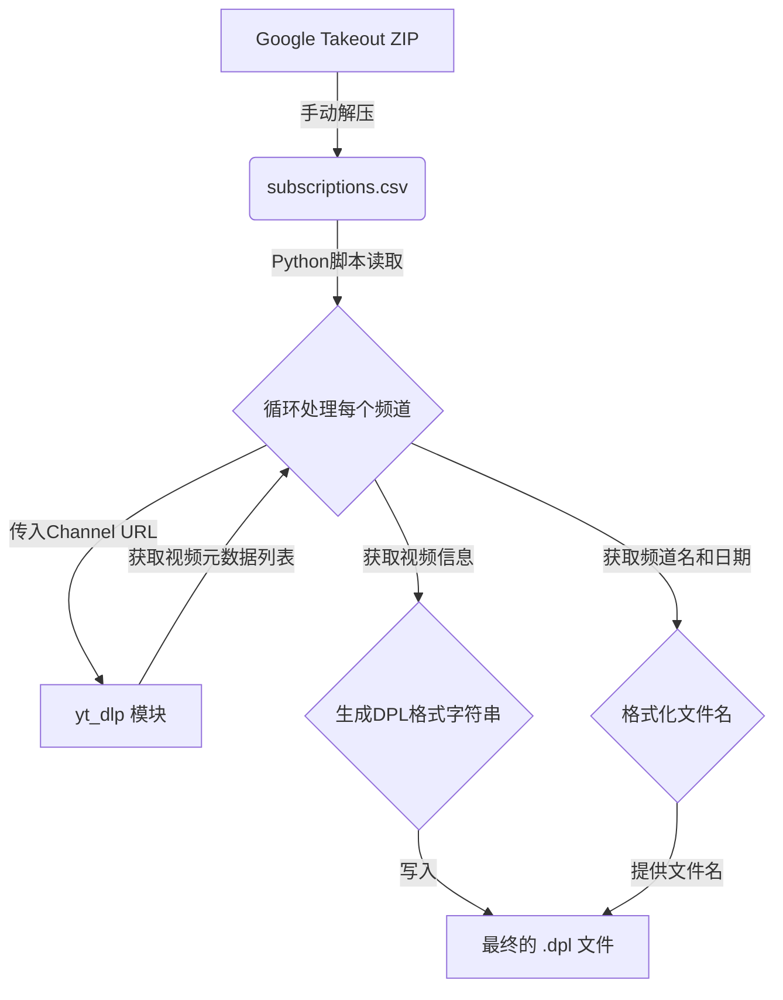

# 项目名称: YouTube Subscription to DPL Converter

## 1. 项目目标 (Project Goal)

本项目旨在创建一个自动化工具，该工具能够读取从 Google Takeout 导出的 YouTube 订阅列表（`subscriptions.csv`），并为每一个订阅的频道生成一个自定义格式的 `.dpl` (Daum PotPlayer) 播放列表文件。每个播放列表将包含该频道所有的视频信息，包括链接、标题和封面。

## 2. 核心工作流程 (Core Workflow)

整个流程可以分解为以下几个关键步骤：

**[输入] -> [处理] -> [输出]**

1.  **获取输入文件**:
    * **手动步骤**: 用户需要先通过 **Google Takeout** (takeout.google.com) 导出自己的 YouTube 数据。
    * 在导出选项中，只选择 "YouTube and YouTube Music"。
    * 下载并解压导出的 `.zip` 文件。
    * **关键文件**: 在解压后的目录 `Takeout/YouTube and YouTube Music/subscriptions/` 中找到 `subscriptions.csv` 文件。这个文件是本脚本的唯一输入。

2.  **解析订阅列表**:
    * 使用 Python 的 `csv` 模块读取 `subscriptions.csv` 文件。
    * 这个 CSV 文件包含 `Channel Id`, `Channel Url`, `Channel Title` 等列。
    * 我们的脚本需要遍历这个文件，提取出每一行的 **`Channel Url`** 和 **`Channel Title`**。这是后续抓取操作的基础。

3.  **抓取频道视频信息**:
    * 对于从 CSV 文件中获取的每一个 `Channel Url`：
    * 调用 `yt_dlp` 库来抓取该频道下的**所有**视频信息。
        * **关键**: 我们不是要下载视频，而是仅提取视频的元数据 (metadata)。
        * `yt_dlp` 提供了直接在 Python 中调用的接口，可以非常方便地实现这一点。
    * 对于频道中的每一个视频，我们需要提取三个核心信息：
        1.  **视频链接 (URL)**
        2.  **视频标题 (Title)**
        3.  **视频封面链接 (Thumbnail URL)**

4.  **格式化播放列表内容**:
    * 为每一个频道创建一个符合您指定格式的字符串。
    * 文件以一行 `DAUMPLAYLIST` 开头。
    * 之后，针对该频道下的每一个视频，重复以下三行模板：
        ```
        N*file*{YouTube视频链接}
        N*title*{视频标题}
        N*thumbnail*{视频封面}
        ```
    * 将所有视频的信息按此格式拼接成一个大的字符串。

5.  **生成并保存 `.dpl` 文件**:
    * 为每个频道（即 CSV 中的每一行）生成一个独立的 `.dpl` 文件。
    * **文件名格式**: `{订阅者}_{今天日期}.dpl`，例如 `AwesomeChannel_2025-07-13.dpl`。
        * `{订阅者}` 来自 CSV 文件中的 `Channel Title`。需要注意处理文件名中不允许的特殊字符（如 `\ / : * ? " < > |`）。
        * `{今天日期}` 使用 Python 的 `datetime` 模块获取当前日期并格式化。
    * 将上一步生成的播放列表字符串内容写入对应的 `.dpl` 文件中，并确保使用 `UTF-8` 编码以支持多语言标题。

## 3. 技术实现思路 (Technical Blueprint)

### 关键 Python 模块:

* **`csv`**: 用于读取 `subscriptions.csv`。
* **`os`**: 用于文件和目录操作，例如创建输出文件夹。
* **`datetime`**: 用于生成文件名中的当前日期。
* **`yt_dlp`**: 核心模块，用于从 YouTube 抓取元数据。
* **`re` (可选)**: 用于清理频道标题中的非法文件名字符。

### `yt_dlp` 使用策略:

在 Python 中使用 `yt_dlp` 时，我们需要配置一些选项来精确地获取所需信息，而不是下载视频。

```python
# 伪代码/思路
import yt_dlp

def fetch_channel_videos(channel_url):
    ydl_opts = {
        'extract_flat': True,  #  'flat' 模式，只获取列表信息，不访问每个视频页面，速度极快
        'quiet': True,         #  不在控制台打印过多信息
        'force_generic_extractor': True, # 确保作为通用播放列表处理
        'skip_download': True, # 明确指示不要下载任何内容
    }

    with yt_dlp.YoutubeDL(ydl_opts) as ydl:
        info_dict = ydl.extract_info(channel_url, download=False)
        # info_dict['entries'] 将会是一个包含所有视频信息的列表
        # 每个 entry 是一个字典，包含 'url', 'title', 'thumbnail' 等键
        return info_dict.get('entries', [])
```

## 4. 数据流图 (Data Flow)



## 5. 待考虑的挑战与优化 (Challenges & Considerations)

* **错误处理**:
    * 如果某个 YouTube 频道已被删除或设为私有，`yt_dlp` 会抛出错误。需要使用 `try...except` 结构来捕获这些异常，然后跳过该频道，继续处理下一个。
    * `subscriptions.csv` 文件不存在或路径错误的处理。

* **性能问题**:
    * 如果一个频道有数千个视频，`yt_dlp` 一次性获取所有信息的列表可能会稍有延迟，但 `extract_flat` 模式已经是非常高效的方案。
    * 整个过程是 I/O 密集型（网络请求），可以考虑使用多线程或 `asyncio` 来并发处理多个频道，但这会增加代码复杂性，初期可以先用简单的串行循环实现。

* **文件名清理**:
    * YouTube 频道的标题可能包含各种特殊字符，必须编写一个函数来清理这些字符，以生成合法的文件名。

* **`yt_dlp` 的维护**:
    * YouTube 网站的结构会不时变更，可能导致 `yt_dlp` 失效。需要提醒用户，如果脚本出错，首先应该尝试更新 `yt_dlp` 库 (`pip install --upgrade yt_dlp`)。

## 6. 最终产出示例

**输入**: `subscriptions.csv` 中的一行 -> `Channel Title`: "Tech Glimpse", `Channel Url`: "https://www.youtube.com/channel/UC..."

**输出文件**: `Tech Glimpse_2025-07-13.dpl`

**文件内容**:
```dpl
DAUMPLAYLIST
N*file*[https://www.youtube.com/watch?v=video1_id](https://www.youtube.com/watch?v=video1_id)
N*title*Cool New Gadget Review
N*thumbnail*[https://i.ytimg.com/vi/video1_id/hqdefault.jpg](https://i.ytimg.com/vi/video1_id/hqdefault.jpg)
N*file*[https://www.youtube.com/watch?v=video2_id](https://www.youtube.com/watch?v=video2_id)
N*title*The Future of AI
N*thumbnail*[https://i.ytimg.com/vi/video2_id/hqdefault.jpg](https://i.ytimg.com/vi/video2_id/hqdefault.jpg)
... (更多视频条目)
```
